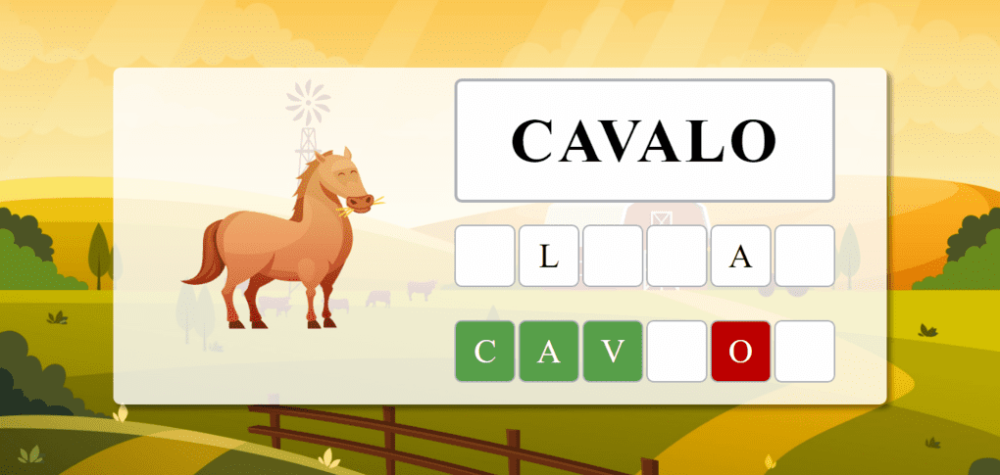

<h1 align="center">
   Jogos inclusivos.
</h1>

<p align="center">
  
  
  
  
  
</p>

<h4 align="center">
  <i>"Site de jogos simples voltados para educação especial. Esse trabalho faz parte de um TCC que visa estudar o movimento de crianças com distúrbio do movimento nas mãos."</i>
</h4>

### FRONT-END `.\client`

#### 🤩 Features

- [x] Tela inicial com multi jogos.
- [ ] LGPD e criação de um termo de condição.
- [ ] Um login super simplista, paga coletar a idade e o apelido do usuário.
- [ ] Jogo #01 - Jogo das Letras.
  - [x] Relátorio
  - [x] Funcionalidades
  - [ ] Acessibilidade
    - [ ] Libras
- [ ] Jogo #02 - Jogo das Sílabas.
- [ ] Jogo #03 - Jogo de ligar o ponto.
- [ ] Jogo #04 - Jogo da Memória.
- [ ] Área de relatórios
  - [ ] Histórico do aluno
  - [ ] Link para Impressão dos jogos jogados no dia.

#### 🗻 Pré-requisitos

Antes de começar, você vai precisar ter instalado em sua máquina as seguintes ferramentas:
[Git](https://git-scm.com) e o [Node.js](https://nodejs.org/en/).
Além disto é bom ter um editor para trabalhar com o código como [VSCode](https://code.visualstudio.com/)

```bash
# Clone este repositório
$ git clone https://github.com/azevgabriel/educacao_especial.git

# Acesse a pasta do projeto no terminal/cmd
$ cd educacao_especial/client

# Instale as dependências
$ yarn

# Inicie o serviço
$ yarn dev
```

### INFORMAÇÕES GERAIS

#### ✨ Tecnologias

As seguintes ferramentas foram usadas na construção do projeto:

- [Typescript](https://www.typescriptlang.org/)
- [Yarn](https://yarnpkg.com/)
- [React](https://pt-br.reactjs.org/)
- [Styled-Components](https://styled-components.com/)
- [React-Router](https://reactrouter.com/)
- [Vite](https://vitejs.dev/)

#### Contribuidores

<table>
  <tr>
    <td align="center">
      <a href="https://github.com/azevgabriel">
        <br>
        <sub>
          <b>Gabriel Azevedo</b>
        </sub>
      </a>
    </td>
    <td align="center">
      <a href="https://github.com/leoalmelin">
        <br>
        <sub>
          <b>Leonardo Almelin</b>
        </sub>
      </a>
    </td>
  </tr>
</table>
